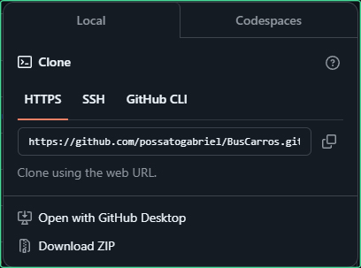
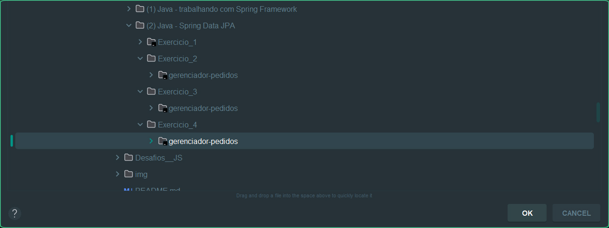

# ☕ Desafios de Java 

## 📰 Descrição

Desafios opcionais de Java propostos durante a primeira formação da Alura

## 💻 Tecnologias Utilizadas

`Trabalhados durante os cursos:`

 

## 🛠️ Como executar o programa

- Passo 1: Baixe o ZIP do projeto ***(escolha a versão em "Releases" ou apenas clique em "Code")*** e descompacte a pasta

- Passo 2: Abra o projeto utilizando a <a href = "https://www.jetbrains.com/pt-br/idea/">IDE do Intellij</a> e clique em **"Setup SDK"**

- Passo 3: Clique em **"Download JDK"**

- Passo 4: Instale a versão mais recente (ou, em caso de problemas, ***instale a versão demonstrada na imagem***)

- Passo 5: Após a instalação, procure a classe principal e execute o programa

## 🙋 Autores
[   Gabriel Possato ](https://github.com/possatogabriel)
 
 

    
