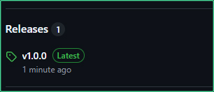
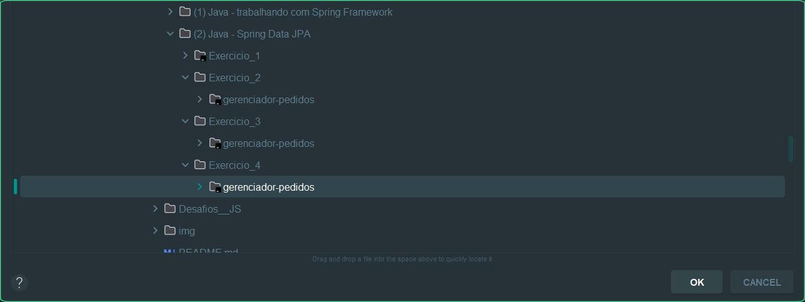
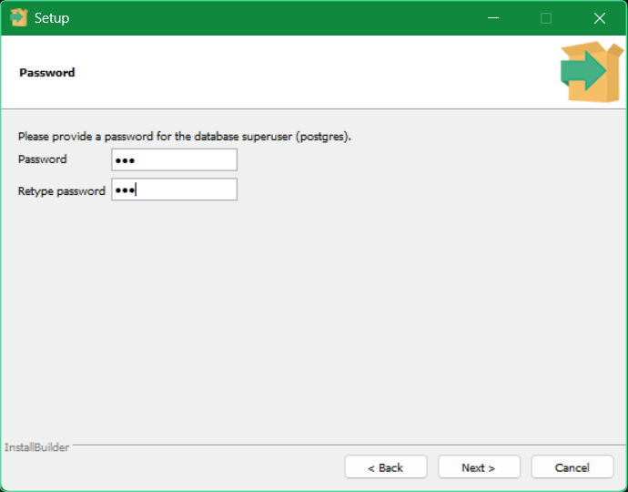
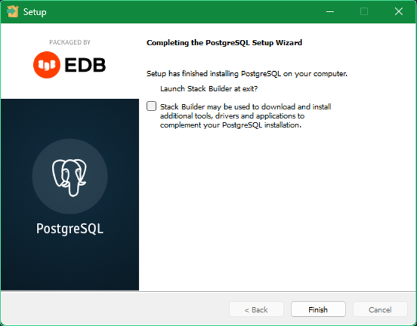
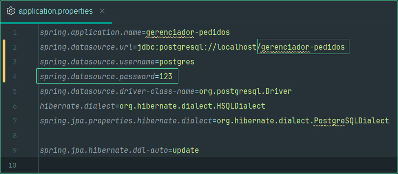
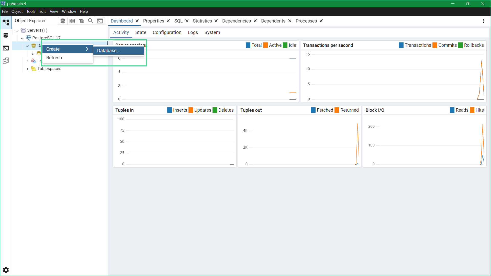
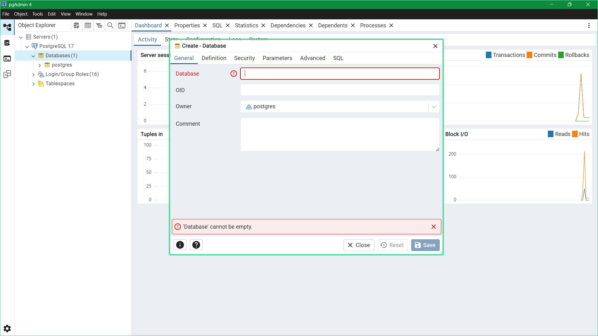

# 🔥 Desafios da Alura

## 📰 Descrição

Resolução dos desafios opcionais propostos durante as aulas da Alura

## 💻 Tecnologias Utilizadas

`Trabalhados durante os cursos:`

  

`Desenvolvido anteriormente pela Alura:`

 

## 🛠️ Como executar o programa (Java)

- Passo 1: Baixe o ZIP do projeto ***(escolha a versão em "Releases" ou apenas clique em "Code")*** e descompacte a pasta

- Passo 2: Abra o projeto utilizando a <a href = "https://www.jetbrains.com/pt-br/idea/">IDE do Intellij</a> e clique em **"Setup SDK"**

- Passo 3: Clique em **"Download JDK"**

- Passo 4: Instale a versão mais recente (ou, em caso de problemas, ***instale a versão demonstrada na imagem***)

- Passo 5: Após a instalação, procure a classe principal e execute o programa

## 🚧 Como executar o programa (Postgres)

* Passo 1: Para os **exercícios com integração ao banco de dados**, instale <a href = "https://www.enterprisedb.com/downloads/postgres-postgresql-downloads">a versão mais recente do Postgres</a>

* Passo 2: Durante a instalação, **coloque a senha *"123" (ou outra senha fácil)*** 

    * Você pode **desmarcar a opção de inicializar o "Stack Builder" no final da instalação**

- Passo 3: Abra a aplicação e **dentro de *src/main,* copie o nome do banco de dados *(e mude a senha, caso tenha alterado)***

* Passo 4: Abrindo o **Postgres**, clique com o botão direito nos "databases" e crie um novo banco de dados **com o nome copiado anteriormente**

## 🙋 Autores
[   Gabriel Possato ](https://github.com/possatogabriel)
 
 

    

